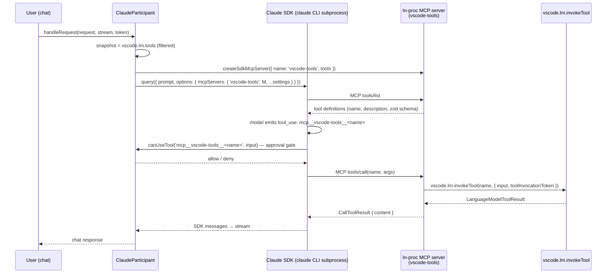

# Proposal: Dynamic VS Code Tool Injection for the Claude Participant

*Status: draft for review — 2026-08-03*

---

## 1. Problem Statement

The three participants in this POC have asymmetric tool-injection capabilities:

| Participant | Injection mechanism | Source of tools | Call-back channel |
|---|---|---|---|
| **Copilot** (`copilotParticipant.ts`) | `tools` field on `createSession` / `resumeSession` | `vscode.lm.tools` enumerated at session start (`buildVsCodeTools()`, line ~588) | `external_tool.requested` → `vscode.lm.invokeTool()` → `session.rpc.tools.handlePendingToolCall()` |
| **Codex** (`codexParticipant.ts`) | `dynamicTools` param on `thread/start` | `DynamicToolManager.buildDynamicTools()` over `vscode.lm.tools` (+ fallback list) | `item/tool/call` RPC → `vscode.lm.invokeTool()` → `DynamicToolCallResponse` |
| **Claude** (`claudeParticipant.ts`) | `Options.mcpServers` (only available surface) | **Hardcoded 5-tool stub that is never actually registered** | *None — broken* |

### What is broken today

`src/claude/clientToolMcpServer.ts`:

1. Imports `createSdkMcpServer` and `tool` from the SDK and defines 5 tools
   (`vscode_readFile`, `vscode_grepSearch`, `vscode_fileSearch`,
   `vscode_listDirectory`, `vscode_readLints`) — but **never calls
   `createSdkMcpServer()`**. The tool definitions are constructed and discarded.
2. `getConfig()` returns a **fake stdio config**:
   ```ts
   const config = { command: process.execPath, args: [] as string[], env: {} };
   ```
   The SDK would interpret this as "spawn bare `node` as a stdio MCP server",
   which cannot speak MCP. The server fails to connect and contributes zero tools.
3. `claudeParticipant.ts:123` hides the type mismatch with a conditional-type cast:
   ```ts
   (options.mcpServers ??= {})['vscode-tools'] = this._clientToolServer.getConfig()
       as Options['mcpServers'] extends Record<string, infer V> ? V : never;
   ```
4. Even if fixed, the 5 tools are **static reimplementations** over
   `workspace.fs` / `findFiles` — they do not enumerate `vscode.lm.tools`, so
   VS Code's real tools (editFile, terminal, search, third-party tools) are never
   exposed. This is not "dynamic" injection.

### Goal

Give the Claude participant the same capability the other two have: **discover
`vscode.lm.tools` at turn time, register them with the Claude SDK, and route
invocations back through `vscode.lm.invokeTool()`** — using the only mechanism
the Claude Agent SDK provides: an in-process MCP server.

---

## 2. Clarifying a Misconception: `createSdkMcpServer` vs. Settings-Based MCP

`Options.mcpServers` is a single map, but its values are a union of two very
different kinds (`sdk.d.ts:1007`):

```ts
export declare type McpServerConfig =
    | McpStdioServerConfig          // serializable — SDK spawns the process
    | McpSSEServerConfig            // serializable — SDK connects over SSE
    | McpHttpServerConfig           // serializable — SDK connects over HTTP
    | McpSdkServerConfigWithInstance; // NOT serializable — live in-process server
```

- **Workspace/user-settings MCP servers** (`.mcp.json`, `settings.json`
  `mcpServers` blocks) are passed as *serializable* stdio/SSE/HTTP configs. The
  SDK (or the CLI itself, when `settingSources` includes the relevant scope)
  owns their lifecycle. They can be hot-swapped at runtime via
  `Query.setMcpServers()` (`sdk.d.ts:2432`).
- **In-process tools** use `createSdkMcpServer()` + `tool()`, which returns a
  `McpSdkServerConfigWithInstance` — `{ type: 'sdk', name, instance: McpServer }`
  holding a **live, non-serializable server object**. Its handlers run in the
  host process. These are baked into `Options` at query creation; changing the
  tool set requires recreating/restarting the query.

So `createSdkMcpServer` is *not* the mechanism that carries workspace MCP
settings — it is the dedicated mechanism for **client-side tools**, and the two
kinds coexist in the same `mcpServers` map. This proposal uses it for its
intended purpose and additionally adds settings passthrough (currently missing
entirely from the Claude participant) as a separate, orthogonal item (§6).

---

## 3. Precedent: VS Code's Production Claude Agent Host

VS Code's own Claude integration (`src/vs/platform/agentHost/node/claude/`)
validates this exact architecture:

| Production artifact | What it does |
|---|---|
| `clientTools/claudeClientToolMcpServer.ts` — `buildClientToolMcpServer()` | Builds an in-process MCP server named `'client'` from workbench `ToolDefinition[]` snapshots; registered as `Options.mcpServers['client']`. Each handler extracts the originating `tool_use_id` from `extra._meta["claudecode/toolUseId"]` and parks on a `PendingRequestRegistry` until the workbench echoes the result. |
| `claudeServerToolMcpServer.ts` — `buildServerToolMcpServer()` | Second in-process server for host-side tools; handlers execute synchronously in-process via `IAgentServerToolHost.executeTool()`. |
| `claudeJsonSchemaToZod.ts` — `jsonSchemaToZodRawShape()` | Converts the JSON Schema carried by tool definitions into the Zod raw shape required by the SDK's `tool()` factory, with per-property fallback to `z.any()`. |
| `claudeSdkOptions.ts` — `buildClientMcpServers()` | Consumes a tool-diff snapshot and returns `{ client: server }` or `undefined` when empty (so `Options.mcpServers` is omitted entirely). |
| `serverToolAllowList()` | Builds approval allow-lists as `mcp__<serverName>__<toolName>` — confirming the namespacing the SDK applies to MCP tools. |
| `roadmap.md` / `phase6.1-plan.md` | Documents the constraint: **in-process tools (`createSdkMcpServer` + `Options.mcpServers`) are restart-required on change; external servers (`setMcpServers`) are hot-swappable.** |

Our participant can be **simpler** than the production one: VS Code needs the
`tool_use_id` + pending-registry dance because its client tools live in a
*different process* (workbench ↔ agent host). Our participant runs entirely in
the extension host, so the MCP tool handler can call `vscode.lm.invokeTool()`
directly — no registry, no cross-process echo.

---

## 4. Detailed Design

### 4.1 Call flow



### 4.2 Module: `src/claude/clientToolMcpServer.ts` (rewrite)

Replace the current stub with a real factory. Public surface:

```ts
import type { McpSdkServerConfigWithInstance } from '@anthropic-ai/claude-agent-sdk';

/** Per-turn context that MCP tool handlers need to call back into VS Code. */
export interface ClaudeTurnContext {
    request: vscode.ChatRequest;          // carries toolInvocationToken
    token: vscode.CancellationToken;
}

/**
 * Discover vscode.lm.tools, filter built-in collisions, and build an
 * in-process SDK MCP server whose handlers route through
 * vscode.lm.invokeTool() using the supplied turn context.
 *
 * Returns undefined when no tools are available (caller omits mcpServers entry).
 */
export async function buildClientToolMcpServer(
    turnContext: () => ClaudeTurnContext | undefined,
): Promise<McpSdkServerConfigWithInstance | undefined>;
```

Key implementation points:

**a) Tool discovery** — mirror `copilotParticipant.buildVsCodeTools()` and
`DynamicToolManager._fromLmTools()`:

```ts
const CLAUDE_BUILTIN_COLLISIONS = new Set<string>([
    // Claude harness built-ins that must never be shadowed.
    // MCP tools are namespaced mcp__vscode-tools__<name> so collisions are
    // unlikely, but keep the filter for parity with the other participants.
]);

function discoverTools(): vscode.LanguageModelToolInformation[] {
    const tools = vscode.lm.tools ?? [];
    return tools.filter(t => !CLAUDE_BUILTIN_COLLISIONS.has(t.name));
}
```

Fallback when `vscode.lm.tools` is unavailable (proposed API not enabled):
reuse the hardcoded minimal list from `DynamicToolManager._fallbackTools()`
(export it from `src/tools/dynamicToolManager.ts` and share).

**b) JSON Schema → Zod conversion.** The SDK's `tool()` requires a Zod raw
shape (`AnyZodRawShape`), while `vscode.lm.tools` carries JSON Schema. Port
VS Code's `jsonSchemaToZodRawShape()`
(`vscode/src/vs/platform/agentHost/node/claude/clientTools/claudeJsonSchemaToZod.ts`):
narrow-subset conversion, per-property `try/catch` fallback to `z.any()`,
`required` handling via `.optional()`. A single malformed property must never
reject an entire tool.

> zod is already present in `node_modules` (4.4.3, transitive via the SDK, and
> `clientToolMcpServer.ts` already imports it), but it is **not declared** in
> `package.json`. Add `"zod": "^4.4.3"` to `dependencies` explicitly.

**c) Handler — the routing core.** Each tool's handler is a closure in the
extension host:

```ts
sdk.tool(
    def.name,
    def.description ?? `VS Code tool: ${def.name}`,
    jsonSchemaToZodRawShape(def.inputSchema),
    async (args) => {
        const turn = turnContext();
        if (!turn || turn.token.isCancellationRequested) {
            return { isError: true, content: [{ type: 'text', text: 'No active chat turn.' }] };
        }
        try {
            const result = await vscode.lm.invokeTool(def.name, {
                input: args,
                toolInvocationToken: turn.request.toolInvocationToken,
            });
            return { content: toMcpContent(result.content) };
        } catch (err) {
            return { isError: true, content: [{ type: 'text', text: String(err) }] };
        }
    },
)
```

Result mapping (`LanguageModelToolResultPart[]` → MCP `CallToolResult['content']`):

```ts
function toMcpContent(parts: readonly vscode.LanguageModelToolResultPart[]) {
    return parts.map(p => 'text' in p
        ? { type: 'text' as const, text: p.text }
        : { type: 'text' as const, text: JSON.stringify(p) });
}
```

Errors are returned as `isError: true` results, never thrown — a throwing
handler would surface as an SDK-level failure instead of a model-readable
tool result (same convention as VS Code's `buildServerToolMcpServer`).

**d) Server name.** Use `'vscode-tools'` (matches the existing registration
key in `claudeParticipant.ts:123`). Tools become visible to the model and to
`canUseTool` as `mcp__vscode-tools__<toolName>`.

### 4.3 Turn-context binding (the `toolInvocationToken` problem)

`vscode.lm.invokeTool` requires the `toolInvocationToken` of the **current**
chat request. The MCP server's handlers are shared, the token is per-turn.
Solution: a mutable holder consulted by handlers via the `turnContext()`
getter.

Lifecycle in `claudeParticipant.ts`:

```ts
private _turnContext: ClaudeTurnContext | undefined;

// handleRequest(), before the query loop:
this._turnContext = { request, token };
try {
    for await (const msg of q) { ... }
} finally {
    this._turnContext = undefined;   // never leak a token past the turn
    ...
}
```

Same update/clear in `_handleWithWarmQuery()` — critical, because WarmQuery
sessions outlive the turn that created them and their baked-in MCP server
would otherwise invoke with a stale/expired token.

**Concurrency caveat:** one shared holder assumes at most one active turn
across the participant. Concurrent chats would race. This matches the current
design (single shared `_clientToolServer`) and is acceptable for a POC; §9
lists per-session server instances as the escalation path.

### 4.4 Registration in `claudeParticipant.ts`

Replace §3 ("Start client-tool MCP server") — **build per turn, not once**:

```ts
// ── 3. Build in-process tool server + merge settings-based servers ──
const mcpServers: Record<string, McpServerConfig> = {
    ...buildClaudeMcpServerConfigFromSettings(),   // §6, optional phase 2
};
const toolServer = await buildClientToolMcpServer(() => this._turnContext);
if (toolServer) {
    mcpServers['vscode-tools'] = toolServer;
}
if (Object.keys(mcpServers).length > 0) {
    options.mcpServers = mcpServers;
}
```

Why per-turn rebuild:

1. `vscode.lm.tools` can change between turns (extensions activating); a
   shared singleton freezes the snapshot forever.
2. The turn-context closure stays correct by construction.
3. Cost is negligible: building Zod shapes for a few dozen tools is cheap, and
   the SDK connects in-process (no spawn).
4. It matches the production agent host's model (per-query MCP recreation on
   tool diff — `roadmap.md` G2.7).

`dispose()` changes: drop the `stopClientToolMcpServer` bookkeeping (the
server is now owned by each query); keep aborting in-flight queries and
disposing WarmQuery sessions.

### 4.5 WarmQuery interactions

- `_promoteToWarmQuery()` spreads the same `options`, so the promoted session
  inherits the MCP server. The `SessionEntry.mcpServer` field becomes
  unnecessary (the server instance lives inside `options`); remove it or keep
  only for diagnostics.
- **Tool-set changes do not propagate into a live WarmQuery session** — the
  SDK bakes `Options.mcpServers` at `startup()`. This mirrors the documented
  production constraint (restart-required for in-process tools). For the POC:
  accept and log; optionally dispose + re-`startup()` when a tool-diff is
  detected (future work).

### 4.6 Approval integration

`makeCanUseTool` in `claudeOptionsBuilder.ts` already receives every tool
call, including MCP ones, under their namespaced names. Two small updates:

1. `isFileEditTool()` (used by `acceptEdits` mode) should recognize edit tools
   coming through the MCP namespace, e.g. match
   `mcp__vscode-tools__vscode_editFile_internal` / `..._editFile` in addition
   to Claude's native `Edit`/`Write`.
2. Consider auto-allowing `mcp__vscode-tools__*` in `bypassPermissions` mode
   (already the case — bypass allows everything) and logging the un-prefixed
   name for readability.

No new approval UI is needed: `vscode.lm.invokeTool` itself enforces VS Code's
own tool-invocation security model, and tools invoked through it render in the
chat panel like any native tool call.

### 4.7 Long-running tools

The SDK cuts SDK-MCP tool calls at ~60s unless
`CLAUDE_CODE_STREAM_CLOSE_TIMEOUT` is raised (documented above
`createSdkMcpServer` in `sdk.d.ts`). Terminal-command-style tools can exceed
that. Add to `buildClaudeOptions`'s `env` block:

```ts
CLAUDE_CODE_STREAM_CLOSE_TIMEOUT: '300000', // 5 min, tunable
```

---

## 5. Schema-Fidelity Options (decision point)

| Option | Fidelity | Effort | Notes |
|---|---|---|---|
| **A. Port `jsonSchemaToZodRawShape`** (recommended) | High — model sees real parameter names/types | Medium | Battle-tested in VS Code production; ~120 lines; per-property fallback keeps it robust |
| B. Permissive passthrough `{ input: z.record(z.unknown()) }` | Low — model sees one generic `input` object | Trivial | Useful as a first milestone; degrades model tool-use quality |
| C. Raw `McpServer` from `@modelcontextprotocol/sdk` with native JSON Schema `tools/list`/`tools/call` | Highest — no conversion at all | High | Adds a dependency and reimplements what `createSdkMcpServer` gives for free; only worth it if the Zod subset proves lossy |

Recommendation: **A**, with B as the interim state if we want something
working this week.

---

## 6. Optional Phase 2: Settings-Based MCP Passthrough

The Claude participant currently reads **no** MCP configuration (unlike
Copilot's `buildMcpServerConfig()`, which merges the global `mcpServers`
setting with `copilotcli.mcpServers`). For parity:

- Add `src/claude/claudeMcpSettings.ts` with
  `buildClaudeMcpServerConfigFromSettings()` reading `mcpServers` (global) +
  a `claudecli.mcpServers` extension setting, producing stdio/http configs —
  a direct port of the Copilot helper.
- Merge result under the in-process server (§4.4). Name conflicts: the
  in-process `'vscode-tools'` key is reserved; settings entries with that
  name are skipped with a warning.
- Note: the CLI may additionally auto-discover `.mcp.json` depending on
  `settingSources`. VS Code production pins
  `settingSources: ['user', 'project', 'local']`; our options builder sets
  nothing (SDK default). Decide explicitly whether we want project-level
  `.mcp.json` picked up automatically or only explicit settings.

This phase is independent of the dynamic-tools work and can land separately.

---

## 7. File-by-File Change Plan

| File | Change |
|---|---|
| `src/claude/clientToolMcpServer.ts` | **Rewrite.** `buildClientToolMcpServer(turnContext)` factory; `discoverTools()`; `jsonSchemaToZodRawShape()` (ported); `toMcpContent()`; delete fake stdio config, delete 5 hardcoded tools (or demote them to the shared fallback list). |
| `src/claudeParticipant.ts` | §3: per-turn build + merge; set/clear `_turnContext` in both the `query()` path and `_handleWithWarmQuery()`; simplify `dispose()`; drop `SessionEntry.mcpServer`. |
| `src/claude/claudeOptionsBuilder.ts` | Extend `isFileEditTool()` for `mcp__vscode-tools__*` edit tools; add `CLAUDE_CODE_STREAM_CLOSE_TIMEOUT` to `env`. |
| `src/tools/dynamicToolManager.ts` | Export the fallback tool list (and schema/description overrides if reuse is wanted) so the Claude participant shares Codex's fallback. |
| `src/claude/claudeMcpSettings.ts` | **New (phase 2).** Settings passthrough. |
| `package.json` | Add `"zod": "^4.4.3"` to `dependencies` (currently undeclared transitive). |
| `CLAUDE_PARTICIPANT.md` | Update §8 (Dynamic Tools) and the §9 comparison table to reflect the real mechanism. |

---

## 8. Testing Plan

**Unit** (no SDK process needed):
- `jsonSchemaToZodRawShape`: object/required/optional/nested/enum/array
  properties; malformed property → `z.any()`; missing schema → `{}`.
- `discoverTools`: filtering, dedupe, fallback path when `vscode.lm.tools`
  is empty/absent.
- `toMcpContent`: text parts, non-text parts, empty result.
- Handler behavior with `turnContext()` returning `undefined` (→ `isError`),
  cancelled token (→ `isError`), throwing `invokeTool` (→ `isError`, not
  throw).

**Manual E2E** (the POC's normal validation mode):
1. New chat with `@claude`: ask it to list files / search text — verify it
   picks `mcp__vscode-tools__*` tools (visible in SDK messages and logs).
2. Ask for a file edit — verify the edit goes through
   `vscode.lm.invokeTool('vscode_editFile_internal', …)` and renders as a
   proper chat tool-call card with diff UI (not a raw shell write).
3. Permission modes: `default` → approval prompt shows the namespaced tool
   name; `bypassPermissions` → no prompt; `acceptEdits` → edits auto-allowed,
   terminal tools prompted.
4. Second turn in the same conversation (resume path) — tools still work.
5. WarmQuery path: after promotion, invoke a tool on turn 2+ — confirms the
   turn-context refresh works.
6. Configure a stdio MCP server in settings (phase 2) — verify it coexists
   with `vscode-tools`.

---

## 9. Risks & Open Questions

| # | Item | Mitigation |
|---|---|---|
| 1 | `vscode.lm.tools` is a proposed API; may be absent in some hosts | Shared fallback list (§4.2a), same as Codex |
| 2 | Concurrent chats race on the shared turn-context holder | Accept for POC; escalate to per-session MCP server instances (unique server name per session, turn context captured per instance) if needed |
| 3 | WarmQuery sessions keep a stale tool snapshot after extensions activate mid-conversation | Diff-based rebuild (structural/hash compare + dispose/re-`startup()`), mirroring production's `SessionClientToolsDiff` — see §11 refinement 1 |
| 4 | SDK version drift (`^0.3.193`): `extra._meta` fields, timeout env var, `McpServerConfig` union | Pin types we rely on behind our factory; the factory is the only place that touches SDK MCP types |
| 5 | Zod subset conversion lossy for exotic schemas (oneOf/anyOf, $ref) | Per-property `z.any()` fallback (production-proven); revisit option C if model tool-use degrades |
| 6 | 60s default handler timeout kills long terminal runs | `CLAUDE_CODE_STREAM_CLOSE_TIMEOUT` (§4.7) |
| 7 | `settingSources` default behavior for `.mcp.json` auto-discovery is not pinned in our options | Resolved by cross-check: match production `['user', 'project', 'local']` (§11 refinement 2) |

---

## 10. Summary

- The Claude SDK's **only** tool-injection surface is MCP; the correct vehicle
  for client-side tools is `createSdkMcpServer()` → `Options.mcpServers` —
  exactly what VS Code's production Claude agent host does.
- Routing back to VS Code needs **no return channel**: the MCP handler runs
  in the extension host and calls `vscode.lm.invokeTool()` directly, with the
  per-turn `toolInvocationToken` supplied through a turn-context holder.
- The current `clientToolMcpServer.ts` is a non-functional stub (tools defined
  but never attached; bogus stdio config). The rewrite is contained: one
  module rewritten, two files updated, one dependency declared.
- Settings-based MCP passthrough is a separate, additive gap (§6) — it uses
  the *other* half of the `McpServerConfig` union and must be merged with,
  not confused with, the in-process server.

---

## 11. Addendum: Cross-Check Against VS Code's Production `ClaudeAgent`

*Verified 2026-08-03 against `vscode/src/vs/platform/agentHost/node/claude/`
(`ClaudeAgent` in `claudeAgent.ts`, `ClaudeAgentSession` in
`claudeAgentSession.ts`).*

### Claims confirmed

| Proposal claim | Production evidence |
|---|---|
| In-process SDK MCP server is the injection mechanism | `ClaudeAgentSession._buildStartupToolWiring()` (`claudeAgentSession.ts:571`) builds two `createSdkMcpServer` instances into `Options.mcpServers`; called at materialize and on every yield-restart rematerialize |
| Client tools round-trip via `tool_use_id` + registry because they cross a process boundary | Handler reads `extra._meta["claudecode/toolUseId"]`, parks on `PendingRequestRegistry` (`claudeClientToolMcpServer.ts:44-58`); resolved by `ClaudeAgent.onClientToolCallComplete()` (`claudeAgent.ts:2045`) on the workbench's `ChatToolCallComplete` envelope |
| Empty snapshot → omit `mcpServers` | `buildClientMcpServers()` returns `undefined` for empty snapshots (`claudeSdkOptions.ts:160-171`) |
| In-process tool changes require restart | `send()` pre-flight checks `toolDiff.hasDifference` and yield-restarts (`claudeAgentSession.ts:666`) |
| `mcp__<server>__<tool>` namespacing | `serverToolAllowList()` builds that exact prefix |
| JSON Schema → Zod with per-property fallback | `claudeJsonSchemaToZod.ts` (`z.any()` fallback, `required` → `.optional()`) |

### Refinements adopted from the cross-check

1. **Diff-based rebuild for the WarmQuery path.** Production rebuilds only
   when a dirty bit flips — `SessionClientToolsDiff` compares merged snapshots
   structurally (name+description+inputSchema, order-insensitive) and
   `consume()`/`markDirty()` maintain the C6 race invariant (a `setTools`
   racing an in-flight rebuild re-flips the bit so the next send retries).
   - `query()` path (fresh spawn per turn): unconditional rebuild stays —
     it is equivalent and simpler.
   - WarmQuery path (persistent `Query`): adopt diff detection — reuse the
     Codex participant's `hashTools()` pattern or port structural equality —
     and dispose/re-`startup()` when the snapshot changed. This upgrades the
     risk #3 mitigation from "log + document" to "implemented".
2. **`settingSources` pinned.** Production uses
   `settingSources: ['user', 'project', 'local']` (`claudeSdkOptions.ts:144`),
   i.e. project-level `.mcp.json` discovery is ON. Open question #7 resolves
   to: match production.
3. **Drain in-flight tool calls before rebind.** Production's
   `_rebindForSyncedState()` rejects all parked client-tool handlers with
   `CancellationError` before the pipeline rebind. Our direct-`invokeTool`
   handlers park nothing, but the WarmQuery restart path must cancel in-flight
   invocations via the turn's `CancellationToken`.
4. **`allowedTools` auto-approve (optional optimization).** Production
   auto-approves trusted server tools via `allowedTools` (excluding
   `requiresConfirmation` ones) so they bypass `canUseTool`. Deferred for the
   POC; everything-through-`canUseTool` is correct, just chattier.
5. **Single server is fine.** Production splits `client` (workbench
   round-trip) and server-tools (in-process execution) because it has two
   execution domains. Our tools all funnel through `vscode.lm.invokeTool`,
   so one `vscode-tools` server is the right shape.
